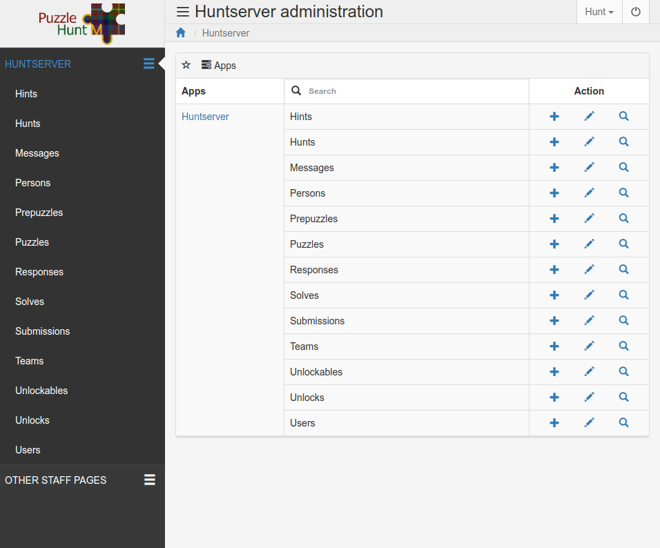
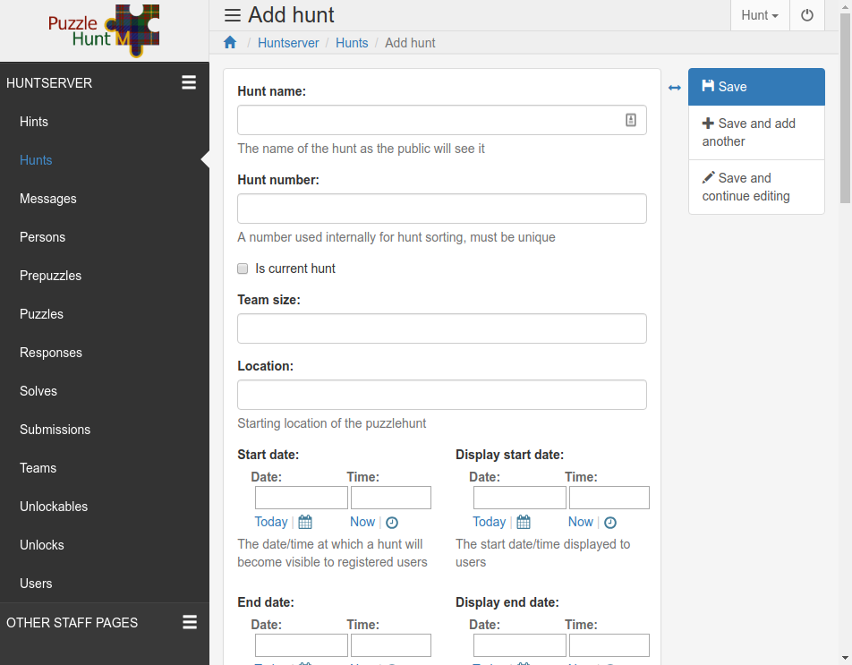

How to Create a Hunt
********************

.. contents:: Table of Contents

This is a guide describing how to set up a new puzzlehunt on the PuzzlehuntCMU
server. This guide assumes that the server itself is already set up and that you
already have an account on the server with both "Staff" and "Superuser"
permissions.

Prepare the Hunt Content
========================

Before anything is done on the server you should decide on some basic details
about the hunt. You can always come back and edit these details later if they
change. Some things to think about:

  + Hunt Name
  + Hunt Date
  + Hunt duration
  + Hunt starting location
  + Max team size
  + Number of puzzles in the hunt
  + Unlocking structure for the puzzles in the hunt

Those first 5 details are especially important because they will be visible on
the front page as soon as you establish this hunt as the current hunt.

Create the Hunt Object
======================

You aren't going to get very far without a hunt object to attach all of this
data to, so sign in with your staff account and navigate over to 
``{server URL}/staff``. You should be greeted with a page like the one below:

Click on the "Hunts" label either in the center or on the left-hand sidebar.

Once on the hunts page, click the blue "+" button in the upper right-hand corner
to create a new hunt object. The page should now look like the below image:

Start by filling out everything in the "Basic Info" section.

.. Caution:: Checking the "Is current hunt" box will make this hunt the hunt
   visible on the front page of the website. Only do so if all of the public
   facing details (everything in the "Basic Info" section) are correct.

.. Important:: **There are two start and end dates.** 

   "Start Date" and "End date" are for internal use and will control things
   like when the puzzles become available to the players, when teams start
   gaining points for point based hunts, and when the hunt will automatically
   stop accepting answers.

   "Display start date" and "Display end date" are the dates/times displayed on
   the front page of the website and control nothing.

   In general, set the display dates for when people should arrive and leave and
   set the actual dates for when teams should be actively solving puzzles.

Next, fill in the two fields in the "Hunt Behavior" section, the help texts
should be pretty self explanatory.

The next section covers the "Resources/Template" section. If you don't want to
deal with making the hunt template right now just type anything you want in the
template field and then skip to "Hint Unlock Plans" below.

Editing the Hunt Template
-------------------------
This is where we give the hunt its look and feel. Before this point, navigating
to the hunt page would just give you a blank page. 

Basic Information
^^^^^^^^^^^^^^^^^

Everything typed into the "Template" form on the hunt editing page will be run
through Django's templating engine and rendered as HTML on the hunt main page.

You can find documentation about Django's template language here:
https://docs.djangoproject.com/en/2.2/ref/templates/language/.
I'd recommend reading the "Variables", "Filters", and "Tags" sections.

Speaking of variables, the following variables will be passed to the renderer
for use in the template:

:hunt: The current hunt object
:team: The team object for the team of the user currently visiting the page
:puzzles: A list of puzzle objects that the team currently has unlocked, sorted
  by puzzle number
:solved: A list of puzzle objects that the team currently has solved, unsorted

.. Tip:: You can view the fields that are available to access on each of the
   team, hunt and puzzle objects in the :doc:`models documentation <models>`.

Since version 3.0, in order to reduce repository clutter, it is now against
policy to commit files specific to a certain hunt to the repository. This means
that you are no longer allowed to load resource files directly onto the server.

To still allow the use of new static files in each hunt, there is now a field on
each hunt's admin page for a resource URL. This URL should point to a publicly
accessible zip file, which contains all static media needed for the main hunt
page. The resources can be downloaded by clicking the "Resources" button next to
the appropriate hunt on the Hunt Management page. After the resources have been
downloaded, they will be accessible through the use of a special template tag.

The ```` template tag will insert the URL to the current hunt's
resource directory. For example, putting the text 
``myimage.png`` in the template would insert the URL to the
file ``myimage.png``.

Inheriting the Base Template
^^^^^^^^^^^^^^^^^^^^^^^^^^^^

It is recommended to start your template out with the following code:

.. code-block:: html

  

  
    Your content here
  

The above code inherits the
`hunt_base.html <https://github.com/dlareau/puzzlehunt_server/blob/master/huntserver/templates/hunt_base.html>`_
template, which in turns inherits the 
`base.html <https://github.com/dlareau/puzzlehunt_server/blob/master/huntserver/templates/base.html>`_
template. You don't need to know the contents of those two files, just that they
provide the basic functionality like the site header and they define the
following blocks that you can override for additional custom behavior:


  This block controls what title is in the web browser tab. The default value
  for this block is "Puzzlehunt!"


  This block controls what content will be sourced/included before the standard
  Bootstrap and Jquery imports. This allows you to override unwanted bootstrap
  styles. The default value for this block only imports hunt_base.css.


  This block controls what content will be sourced/included after the standard
  Bootstrap and Jquery imports. This is for content that you want to use to
  extend those libraries, or content that relies on those libraries.


  This block controls what content will be inserted at the bottom of the page.
  The default value is links to our social media and bridge page. 

You can read more about Django template inheritance and blocks here:
https://docs.djangoproject.com/en/2.2/ref/templates/language/#template-inheritance

.. Warning:: While you may use completely custom HTML, it is STRONGLY
   RECOMMENDED that you follow the instructions below on how to inherit the base
   template to get nice features like the header bar, common style sheets,
   Google analytics, and graceful degradation when the hunt becomes public.

Starter Example
^^^^^^^^^^^^^^^

While you may now technically have all of the information you need, that
doesn't mean you know what to do with it. Below is a simple example based one of
our first hunts to use this server. It will show the puzzles, display the
answer for any solved puzzles, and demonstrates how to break a hunt into two
rounds.

.. code-block:: html

  
  Puzzles!
  
  
  <link rel="stylesheet" type="text/css" href="{{ STATIC_URL }}huntserver/hunt_base.css">
  
  
  
  
  

    

      

        <h1 class="title">Puzzlehunt: The Musical</h1>
        

          <table>
            <thead>
              <tr>
                <th style='width: 320px'>Puzzle Name</th>
                <th style='width: 180px'>Solution?</th>
              </tr>
            </thead>
            <tbody>
              
                
                  </tbody>
                  </table>
                  <h3 class="title">- Intermission -</h3>
                  <table>
                    <tbody>
                    <col width="320px">
                    <col width="180px">
                
                <tr id='puzzle{{ puzzle.puzzle_number }}' class='puzzle'>
                  <td>
                    

                      <a href='/puzzle/{{ puzzle.puzzle_id }}/'>
                        {{puzzle.puzzle_name}}
                      </a>
                    

                  </td>
                  <td>
                    
                      {{ puzzle.answer|upper }}
                    
                  </td>
                </tr>
              
            </tbody>
          </table>
        

        
 Feeling stuck? <a href="/chat/">Chat</a> with us

      

    

  

  

Template Wrap Up
^^^^^^^^^^^^^^^^

That should be enough to get you started with template writing. Don't forget to
download resources each time you update them and save often when editing the
template as it won't save if you close or leave the page for any reason.

.. Tip:: You can use ctrl-s/cmd-s to save the page and continue working 

Hint Unlock Plans
-----------------

The final section of the Hunt creation page is for determining if and when hints
will automatically become available to teams. If you do not want to use
automatic hints (or hints at all) in the current hunt, simply ignore this
section. Manual hints can still be awarded from the "Hints" page under the
"Other Staff Pages" sidebar header.

If you do want to automatically award hints during the hunt, there are three
possible unlock mechanisms for hints:

Exact Time Unlock:
  All teams will gain a single hint some amount of time into the hunt. Use the
  unlock parameter field to indicate how many minutes into the hunt this hint
  should be given out.

Interval Based Unlock:
  All teams will gain a hint every X minutes for the entire duration of the
  hunt. Use the unlock parameter field to indicate the number of minutes between
  hints. The first hint will be given out X minutes after the start of the hunt.

Solves Based Unlock:
  Each team will individually be given a hint when they reach a certain number
  of puzzle solves. Use the unlock parameter field to indicate how many solves a
  team needs to unlock this hint.

You may add as many hint unlock plans as you want, using the "Add another Hint
unlock plan" link at the bottom to add additional rows to the table. All hint
plans will trigger independently of each other.

.. Caution::
   "Exact Time Unlock" and "Interval Based Unlock" hints are both calculated
   against the "Start Date" field of the hunt, making it even more important
   that the start date is actually when teams will start solving puzzles and not
   just when teams arrive for check in.

.. Danger::
   Changing a hint unlock plan after the hunt has started can have unexpected
   results. Please take extra care to make sure that the hint plans are correct
   before the hunt starts. 

Hunt object creation wrap up
----------------------------

After you've filled in everything make sure "Is current hunt" box is
appropriately checked or unchecked and hit the blue "Save" button in the upper
right.

Create Puzzle Objects
=====================

Great, now we have a hunt template and we can view our hunt, but that's not good
without any puzzles, so let's add some. 

Start by going to the "Puzzles" section using the side navbar and clicking the
blue "+" button in the upper right-hand corner to be brought to the puzzle
creation page.

The Basics
----------

Start by choosing which hunt the puzzle will belong to and giving the puzzle a
name and an answer.

.. Tip:: Answers are not case sensitive

Next, the puzzle must be given both a number and an ID. The number is for
ordering within the hunt, and controls the order of puzzle objects passed into
the hunt template. The ID used as a unique identifier across all puzzles is used
in the URL for the puzzle. 

.. Note::
   The current trend for ID's is to have the same 3 digit prefix for all puzzles
   in a hunt and to use the puzzle's number as the last 2 digits. This allows
   easy visual grouping of puzzles by hunt, and an ordering over all puzzles.

Attributes
----------

Next are three True/False puzzle properties, all of which default to False:

"Is a metapuzzle"
  Controls which puzzles are marked as metapuzzles for the purpose of
  scoring on the progress page.

"Doesn't Count"
  Controls whether or not the puzzle is discounted from scoring on the
  progress page.

"Is HTML puzzle"
  Controls whether the puzzle is more than just a PDF. If this box is
  checked, the puzzle page will not display a PDF, and instead display a link to
  the HTML content from the "Resource link" discussed below.

Content
-------

Puzzle content is controlled by the following three links:

"Link"
  The link to a publicly accessible PDF of the puzzle (if the puzzle is not an
  HTML puzzle).

"Resource link"
  The link to a publicly accessible ZIP file of the puzzle contents if the
  puzzle is an HTML puzzle. The ZIP file must contain a file named "index.html".
  All links from the index file to other files in the ZIP file should be 
  relative links, as the base URL of the final contents is not guaranteed.

"Solution link"
  The link to a publicly accessible PDF of the puzzle solution. If this field is
  filled in, the solutions for each puzzle will be available on the puzzle page
  after the hunt is over.

.. Tip::
   Linking an unzipped Dropbox folder for the resource link will also work.
   Dropbox will automatically generate a zip file of the folder upon download.

Unlocking the Puzzle
--------------------

Next is the matter of how the puzzle is unlocked. As of version 4.0, there are
now four options for puzzle unlocking:

Solves Based Unlock:
  The puzzle will be unlocked once a certain number of puzzles from a chosen
  subset are solved. Use the puzzle chooser to indicate which puzzles count
  towards unlocking this puzzle. Then enter the number of puzzles required to
  unlock this puzzle in the "Num required to unlock" field. Setting the number
  of required puzzles to zero means that this puzzle will automatically be
  unlocked when the hunt starts.

Points Based Unlock:
  The puzzle will be unlocked once a team has earned enough points. Use the
  "Points cost" field to specify how many points a team needs to unlock this
  puzzle and the "Points value" to specify how many points solving this puzzle
  gives a team. Points will also be given according to the rate specified by the
  "Points per minute" field in the hunt object. Setting the "Points cost" field
  to zero means that this puzzle will automatically be unlocked when the hunt
  starts.

Either (OR) Unlocking:
  Fill out both of the above field pairs and the puzzle will be unlocked when
  either unlocking method's criteria is met.

Both (AND) Unlocking:
  Fill out both of the above field pairs and the puzzle will be unlocked when
  both unlocking method's criteria are met.

Auto-Response Objects
---------------------

At the moment, whenever a user submits a correct answer, the server will
respond with "Correct!" and whenever the user submits a wrong answer the server
will respond with "Wrong Answer". Often you will want additional customized
responses that can do things like tell the user how they are wrong or to tell
them to "Keep going!". 

To create automatic responses, use the "Responses" section at the bottom of the
puzzle creation form. The "Regex" field is a python-style regex checked against
the answer and the "Text" field is the text that will be returned to the team.
The regexes are not applied in any specific order, so answers that match more
than one regex will result in undefined behavior.

.. Tip:: Response text can contain links using markdown style format: 
   [foo](https://link.to.foo)

Puzzle Wrapup
-------------

After filling out everything on the puzzle creation page, hit "Save and add
another" and continue to add puzzles until you have added all of the puzzles for
the hunt. This will take a while; my recommendations are to be patient and have
the unlocking graph on hand.

Create Prepuzzle Objects
========================

As of version 3.3, the server now supports prepuzzles. A prepuzzle is a simpler
puzzle that exists outside of the normal set of puzzles for a hunt. Prepuzzles
are different in a number of ways:

- Prepuzzles do not require users to sign in
- Once published, prepuzzles are accessible before the hunt is open
- Prepuzzle submissions only support auto-response and do not show up on the
  queue page
- Prepuzzles can be, but do not need to be tied to any specific hunt.

Like other above objects, to create a prepuzzle object, navigate to the
prepuzzle section of the admin pages and click the blue "+" icon in the upper
right.

Below is a quick summary of the fields, most of them are similar to other
fields above:

Puzzle name:
  The name the puzzle is given and shown to users
Released:
  Controls whether or not non-staff members can see the puzzle
Hunt:
  Select which hunt this prepuzzle is associated with, leave blank to not
  associate it with any hunt.
Answer:
  The answer to the puzzle, not case sensitive.
Template:
  See the "Prepuzzle Templating" section below
Resource link: 
  Allows the optional inclusion of static files for the prepuzzle, must be a
  link to a publicly accessible ZIP file. See the "Prepuzzle Templating" section
  for details on how to reference the files.
Response string:
  The string that the server sends back to the prepuzzle page when the puzzle is
  solved. In the simple example, this string is just displayed to the user, but
  more complex templates could do anything they desire with this string. 
Puzzle URL:
  This isn't really a field but rather an easy way to copy out the prepuzzle URL
  because it isn't currently accessible from anywhere on the site. 

Prepuzzle Templating
--------------------

As with the hunt "Template" field, everything typed into the "Template" form on
the prepuzzle editing page will be run through Django's templating engine and
rendered as HTML. 

Again, more information about Django's templating language is available here:
https://docs.djangoproject.com/en/2.2/ref/templates/language/.

Unlike the hunt template, the only variable that is passed to this template is a
variable named "puzzle" containing the current prepuzzle object.

Just like the hunt template, it is recommended to use the below code to extend a
basic template, in this case the template name is ``prepuzzle.html``.

.. code-block:: html

  

  
    Your content here
  

The following blocks are available to override in the prepuzzle template:


  This block controls what title is in the web browser tab. The default value
  for this block is the puzzle name.


  This block controls what content will be sourced/included before the standard
  Bootstrap and Jquery imports. This block contains the navbar formatting and
  the javascript helper functions discussed below, so it is not recommended to
  override this block without making a call to ``{{ block.super }}`` inside to
  include the existing contents.


  This block controls what content will be sourced/included after the standard
  Bootstrap and Jquery imports. This is for content that you want to use to
  extend those libraries, or content that relies on those libraries.

The prepuzzle template has some other special functionality added:


  The ```` tag allows access to the files from the
  prepuzzle's resource URL. It works just like the "hunt_static" tag.

check_answer(callback, answer)
  The prepuzzle base template supplies a function called ``check_answer`` that
  will deal with all of the server communication needed for answer checking. The
  function takes a callback function and the user's answer. The answer is then
  submitted to the server, and the the response from the server is then passed
  to the given callback function. The server response is a dictionary in the
  following form: ``{is_correct: True, response: "response string"}``, where
  ``is_correct`` is a boolean indicating whether the answer matches the
  prepuzzle's answer and ``response`` is just a string that is either empty if
  the response was not correct, or the prepuzzle's given response string if the
  answer was correct.


  If you use this include statement it will insert a no-hassle answer submission
  box that includes a spot for users to enter their answer, a submission button
  and will display the prepuzzle's response text if the answer was correct.

.. Warning:: Just like the hunt template, you may use completely custom HTML if
   you want, but it is STRONGLY RECOMMENDED that you follow the instructions
   below on how to inherit the base template to get nice features like the
   header bar, common style sheets, Google analytics, and javascript helper
   funcions.

Hunt Creation Wrapup
====================

If you've been following along, you should now have created everything needed to
run a puzzlehunt. Head over to section 2: :doc:`How to Run a Hunt
<hunt_running>` for specific information on how to use the other parts of the
staff site.