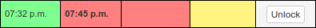

How to Run a Hunt
*****************

So you want to run a puzzlehunt...

Here are all of the things you should need to know to run an already created
puzzlehunt:

Staff Pages
===========

Below are descriptions of all of the custom staff pages, their features and how
to interact with them. All of these pages are accessible under the "Other Staff
Pages" header of the sidebar. The first 4 pages are critical to keep up during
the hunt, the latter 4 pages are more situational and will likely be more useful
before or after the hunt.

Progress Page
-------------

The progress page shows all the teams, and their progress in the hunt.

.. Tip:: The table is pretty large, it is recommended to click the three lines
   next to "Django administration" at the top to collapse the side navbar for
   more room.

The main focus of the page is the large status table. The table lists puzzles
across the top, and teams down the side. Each cell in the table is the team's
status on the corresponding puzzle, represented by one of 4 possible states:

From left to right:

Green Box with a Time
  The team solved the puzzle at the specified time.

Yellow/Orange/Red Box with a Time
  The team has unlocked the puzzle but has not yet solved the puzzle. The time
  is the time of the team's last submitted guess. The box will start yellow when
  they first unlocked the puzzle and will slowly change to red over the course
  of 4 hours. This can be helpful to see how long a team has been stuck on a
  puzzle.

Yellow/Orange/Red Box without a Time
  The team has unlocked the puzzle but has not yet solved the puzzle and has not
  yet submitted a guess. The box follows the same yellow to red color scheme as
  above.

White box with an "Unlock" Button
  The team has not yet unlocked the puzzle. The button can be clicked to
  manually unlock the puzzle for the team.

On the left side of the table there are 3 columns next to the team's name. They
indicate the number of metapuzzles the team has solved, the number of normal
puzzles the team has solved and the last time that the team has solved a puzzle.
Above the table there is a checkbox alongside 3 dropdowns that allows you to
sort the table by these three columns instead of the default A-Z team name sort.

Queue Page
----------

The queue page shows team's puzzle answer guesses as they come in. The main
table on the page has one row for each submission. As the table header says, the
table shows the team, the puzzle, the submission, the submission time, and the
response. The row will be color coded for each submission: red for wrong and
green for correct.

The response column also has a "Fix" link next to each response. Clicking it
will bring up a form where you can edit the response to the submission. The
edited response will automatically be pushed to the team's puzzle page. This can
be used to nudge a team in the correct direction if they are close or have
possibly just misspelled something.

Above the table there are two dropdown selectors and a "Filter" button. These
can be used to filter the shown submissions on the queue page by Team or Puzzle.

Chat Page
---------

The chat page allows staff to chat with teams during the hunt. Every team in the
hunt has a button on the lefthand side that will bring up the chat box for that
team. The currently selected team will be shown in blue, and teams with unread
messages will be shown in red.

.. Attention:: Due to the technical limitations of the server, only messages
   that have arrived while the chat page is open will cause the teams' name to
   turn red, so try not to refresh the page too often after the hunt starts. Its
   also not a bad idea to click around the teams every so often to make sure
   something hasn't slipped through the cracks.

It is possible to check the checkbox at the bottom to "Make the message an
announcement". This will send the message to all teams in the hunt.

Hints Page
----------

The hints page allows you to see hints that teams have requested and respond to
them. Hints will appear one on top of another just like submissions on the queue
page. In addition to the puzzle and team filters like the ones on the queue
page, the hint page also has a "Filter by Status" dropdown that lets you view
only the answered or unanswered hints.

Each hint that comes in will start with a space for you to type a response and
hit submit. After hitting submit the response is sent to the team, but responses
can be further edited by clicking the "Edit Response" link at the bottom, at
which point the new response will be pushed to the team.

Finally, there is a button at the top left of the page titled "Show/Hide hint
counts". Clicking this button will bring up a list of all of the teams and the
number of hints they currently have available to them. Clicking the plus and
minus buttons next to the number of available hints will give or take away
available hints from the team.

.. Note:: There is a very small chance that the team naturally gains a hint in
   same time period that you click to give them a hint. The counter will tick up
   by two in that case, you probably didn't double click.

Management Page
---------------

The first of the situational pages, the management page allows you to manage the
resources and the overall state of the hunt.

The top portion of the page is list of hunts, one hunt per row. Each row has 3
buttons:

Set current
  This sets the selected hunt as the current hunt for all of the staff pages,
  the site front page and everywhere else.

Download Puzzles
  This downloads all PDFs and resources for all puzzles in the hunt.

Download Resources
  This downloads all resources for the hunt template page.

Each row can also be expanded to reveal an individual download button for each
puzzle.

Underneath the "Hunt Downloads" section is a "Prepuzzle downloads" section which
allows the downloading of resources for any chosen prepuzzle.

Finally, there is a single button at the bottom of the page titled "Reset all
progress". This button resets all team interaction that has happened so far with
a hunt, all submissions, responses, unlocks, solves, hints, and chat messages
are deleted. Normally only used once between playtesting and the start of the
hunt.

Info Page
---------

The info page lists information about teams that are signed up for hunt and the
people on them. Along the left is a list of all of the teams separated into 3
categories: "Needs a room", "Has a room", and "Off Campus" with each team having
a text box next to their name with their current location. You can bulk edit
team locations, for example assigning rooms to "Need a room" teams, and then
click the "Update Locations" button at the bottom to save all the edits for a
certain section.

.. Note:: Teams are listed in signup order with the first team to sign up at the
   top so rooms can be assigned easily in sign up order.

Along the right side of the page is a statistic of how many people are
registered for the hunt for things like ordering food, followed by all listed
dietary restrictions of the registrants. Clicking any dietary restriction will
take you to the corresponding user so you can either contact the user for more
details or edit the restriction if the user has abused the field.

Email Page
----------

The email page allows hunt staff to send an email out to all people registered
for the hunt. To send an email, simply enter a subject, a body and hit send
email.

If you want more customization or formatting than is available from the two
simple textboxes, you can click the button at the bottom of the page to show the
emails of all registered users to allow copy and pasting into your preferred
email client.

Charts Page
-----------

Finally there is the charts page. There are no actions to take on the charts
page, just a bunch of interesting charts. Most charts are pretty
self-explanatory, and offer very helpful mouse-hover information.

The last item on the charts page isn't a chart at all, it is a table showing the
first team to solve a puzzle and when that first solve happened.

Preparing for the Hunt
======================

Download Puzzles
----------------

Before anybody can start playing your hunt, you have to download the puzzles.
Sign into the staff part of the website located at ``{server URL}/staff`` and
head over to the "Management" page located under the "Other Staff Pages" sidebar
header. From there, click the "Puzzles" button next to the current hunt, which
will download all of the puzzles. It take a few minutes, be patient.

That should just work, if it doesn't, check your links, check your PDF
accessibility and try again. (if you really think it is a bug, feel free to
submit an issue)

If any individual puzzle fails to download or you just want to re-download a
single puzzle for some reason, remember that you can un-collapse the hunt and
click the download buttons for individual puzzles.

Playtesting
-----------

You probably want people to test your hunt before the actual event. This is easy
using the puzzlehunt server. Just have the team of playtesters sign up like
normal, then navigate to the "Teams" page on the sidebar, find the team,
check the "Playtester" checkbox on their edit page, fill in the playtest start
and end dates and save the team. They will then have access to the puzzlehunt as
if it was open to them during the given dates.

.. Attention:: Playtest start and end dates are a new required part of having a
   team playtest as of version 4.0 due to the number of time based features now
   available.

All interactions with the playtest team should can be done as they normally
would be through the various staff pages described above. Things like the queue,
the progress page, chat, puzzle unlocking, and hints should all work. The only
feature currently not working for playtest teams is time released hints. If you
want playtest teams to get hints, you will have to award them manually from the
"hints" page.

.. Attention:: Again, in a bigger orange box: Time released hints currently do
   not trigger for playtest teams, you must manually award hints from the
   "hints" page.

Running the Hunt
================

Pre-Hunt Checklist
------------------

Okay, the hunt is almost ready to happen, you've downloaded all the puzzles,
you've had people playtest the hunt, and now you're ready to turn it over to the
public. Below is a short checklist of items to consider before the hunt starts.

Before the hunt:
  - [ ] *Make sure the hunt start time is accurate*
  - [ ] Reset all progress from the management page
  - [ ] Ensure all puzzles have working PDFs and images
  - [ ] Ensure teams have been assigned rooms on the info page

TODO: Fix: Ensure that all teams show puzzles as unlocked on the progress page 
(now happening automatically)

During the Hunt
---------------

Hopefully your opening information session went well, the puzzles released
flawlessly and people are now solving puzzles. Time to sit back and watch/make
the magic happen. It is recommended to have open the progress, queue, chat and
hints pages open.

With version 4.0, puzzles should now automatically release at the set hunt start
time, removing the need for the "release initial puzzles" button.

Hunt End
--------

The hunt is nearing completion, hopefully everything went well and enough teams
have completed the hunt for it to end. If you think the hunt hasn't run long
enough, be sure to update the hunt end time before you reach it. 

Once the hunt end time is reached, all puzzles will be available for the public
and all hunt interfaces will update to indicate that the hunt is over. 

Random Info and Common Issues
=============================
**Teams can view their room assignments from the "team info" page**: Let teams
know that if they forget or lose their room assignments (or you just don't feel
like telling them) that they can view their room assignments by clicking "View
Registration" link on the front page.

**What if I find a typo or other issue with a puzzle?**: Simply fix the puzzle,
make sure the new version is uploaded to dropbox and click the download button
for that puzzle from the management page.

**What if I accidentally unlock a puzzle for a team I shouldn't have?:** You can
go to the "Unlocks" tab under the "Huntserver" section of the side navbar and
delete the unlock object for that team/puzzle combo. The team will lose access
to the puzzle.